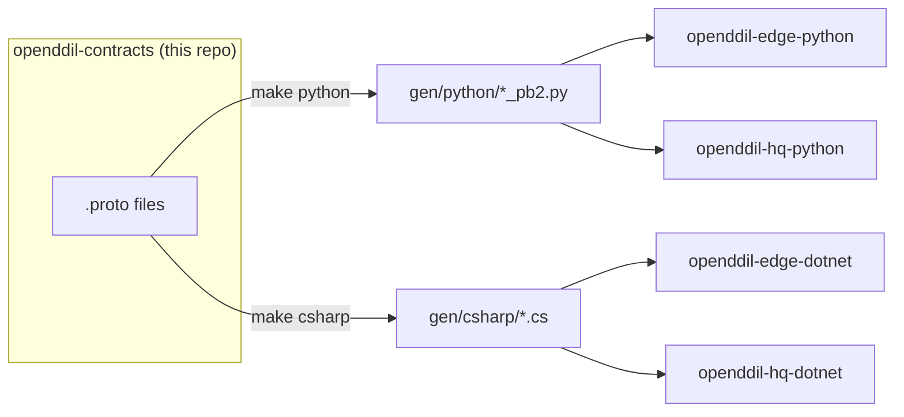

# OpenDDIL Contracts

Language-agnostic Protobuf event schemas for the OpenDDIL framework — the **single source of truth** for all event shapes across Edge SDKs and HQ processors.

## Architecture



## Proto Structure

```
proto/
└── openddil/
    ├── events/v1/
    │   └── cloud_event.proto      # CloudEvents v1.0 envelope (wraps all domain events)
    └── inventory/v1/
        └── inventory_events.proto # ItemAllocatedEvent (inventory domain)
```

### CloudEvents Envelope

Every OpenDDIL event is wrapped in a [`CloudEvent`](proto/openddil/events/v1/cloud_event.proto) message:

| Field | Type | Purpose |
|---|---|---|
| `id` | string | Unique event ID (UUID v4) |
| `source` | string | Origin URI (`openddil://edge/{node_id}`) |
| `spec_version` | string | Always `"1.0"` |
| `type` | string | Event type URI (e.g., `openddil.inventory.v1.ItemAllocatedEvent`) |
| `time` | Timestamp | When the event was produced |
| `user_id` | string | Operator identity (DDIL extension) |
| `edge_node_id` | string | Origin Edge node (DDIL extension) |
| `sequence` | uint64 | Outbox sequence number (DDIL extension) |
| `data` | Any | Domain event payload (packed/unpacked by type_url) |

### Domain Events

| Event | Package | Description |
|---|---|---|
| `ItemAllocatedEvent` | `openddil.inventory.v1` | Edge operator allocates inventory units |

## Quick Start

### Prerequisites

- `protoc` (Protocol Buffers compiler)
- For Python: `pip install grpcio-tools`
- For C#: `Grpc.Tools` NuGet package

### Compile

```bash
# Both Python and C#
make all

# Python only
make python

# C# only
make csharp

# Clean generated files
make clean
```

### Generated Output

```
gen/
├── python/
│   └── openddil/
│       ├── events/v1/cloud_event_pb2.py
│       └── inventory/v1/inventory_events_pb2.py
└── csharp/
    └── openddil/
        ├── events/v1/CloudEvent.cs
        └── inventory/v1/InventoryEvents.cs
```

## Schema Evolution Rules

1. **Additive only**: New fields get new field numbers. Never reuse or renumber.
2. **Never remove required fields**: Mark as `reserved` instead of deleting.
3. **Version via packages**: Breaking changes → new package version (`v1` → `v2`).
4. **Backward compatible**: Old consumers must be able to deserialize new messages (unknown fields ignored).

## AI Documentation

| File | Purpose |
|---|---|
| [`llms.txt`](llms.txt) | Structured project summary for LLM discovery |
| [`.cursorrules`](.cursorrules) | Protobuf coding style and conventions |
| [`AGENTS.md`](AGENTS.md) | AI agent safety guidelines for schema evolution |
